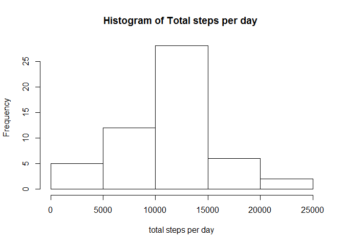
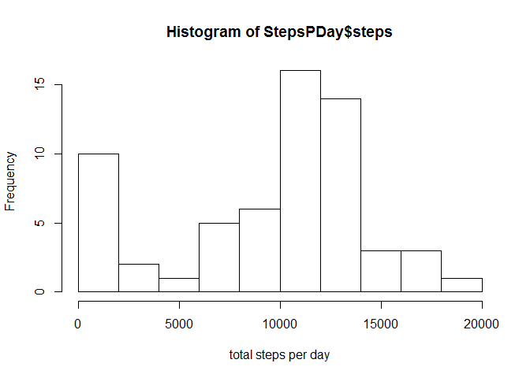
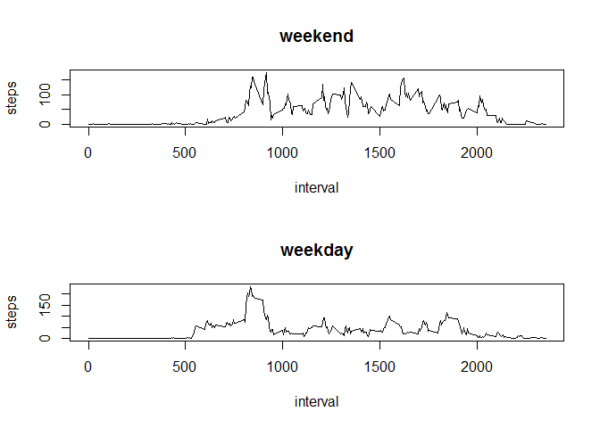

# Reproducible Research: Peer Assessment 1
##Introduction

It is now possible to collect a large amount of data about personal movement using activity monitoring devices such as a Fitbit, Nike Fuelband, or Jawbone Up. These type of devices are part of the "quantified self" movement - a group of enthusiasts who take measurements about themselves regularly to improve their health, to find patterns in their behavior, or because they are tech geeks. But these data remain under-utilized both because the raw data are hard to obtain and there is a lack of statistical methods and software for processing and interpreting the data.

This assignment makes use of data from a personal activity monitoring device. This device collects data at 5 minute intervals through out the day. The data consists of two months of data from an anonymous individual collected during the months of October and November, 2012 and include the number of steps taken in 5 minute intervals each day.

The data for this assignment can be downloaded from the course web site:

Dataset: Activity monitoring data [52K]
The variables included in this dataset are:

steps: Number of steps taking in a 5-minute interval (missing values are coded as NA)
date: The date on which the measurement was taken in YYYY-MM-DD format
interval: Identifier for the 5-minute interval in which measurement was taken
The dataset is stored in a comma-separated-value (CSV) file and there are a total of 17,568 observations in this dataset.

## Loading and preprocessing the data

First we will download and read the .csv file into R.

```r
fileURL<-"https://d396qusza40orc.cloudfront.net/repdata%2Fdata%2Factivity.zip"

if (!file.exists("./data/activity.csv")){
    dir.create("data")
    download.file( fileURL,"./data/activity.zip")
    unzip(zipfile = "./data/activity.zip",exdir  = "./data")
}

Data <- read.csv("./data/activity.csv" )
```

## What is mean total number of steps taken per day?

To determine the mean total number of steps taken per day we will first use the ```aggregate``` function to find the total number of steps per day. 

```r
StepsDate<- aggregate(steps ~ date , data = Data, FUN = sum)
```

We can simply calculate the mean and median from the steps column


```r
median(StepsDate$steps)
```

```
## [1] 10765
```

```r
mean(StepsDate$steps)
```

```
## [1] 10766.19
```

```r
hist(StepsDate$steps , ,xlab = "total steps per day", main = "Histogram of Total steps per day ")     
```

<!-- -->

The histogram above shows the mean total number of steps are distributed. 

## What is the average daily activity pattern?

To see the average daily pattern again we will use the ```aggregate``` function to find the mean number of steps per interval across the days. We will then plot a histogram of total number of steps per day

```r
stepsInt<-aggregate(steps ~ interval, data = Data , FUN = mean)
```

```r
plot(steps ~ interval, data = stepsInt, type ="l")
```

<!-- -->

With the mean number of steps calculated per interval we can then simple use the ```which.max``` functions to find the interval which has the highest average number of steps


```r
stepsInt[which.max(stepsInt$steps),]
```

```
##     interval    steps
## 104      835 206.1698
```

## Imputing missing values

Initially we will complute the number of missing values buy summing the logical vector of the output from the ``` is.na``` function.


```r
sum(is.na(Data$steps))
```

```
## [1] 2304
```

Next we will replace the NA values with the average step count across the days for a given interval.
We can use the ```stepsint``` data frame we calculated above to get the mean steps per interval.
then we can get the location of NAs using hte ```is.na``` function. followed by merging the ```stepsInt``` dataframe with the ```Data``` data frame to create```FullData```.We can then simply remplace the NAs from the steps column with the means from the steps.y column using the ```NAs``` index 


```r
NAs<-is.na(Data$steps)
FullData<- merge(Data,stepsInt, by= "interval", suffixes=c('','.y'))
FullData$steps[NAs]<-FullData$steps.y[NAs]
FullData<-FullData[,c(1:3)]
```
We now have a new dataset ```FUllData```  equal to the original ```Data``` dataset but with NAs imputed with the means for the interval.


Next we will create a histogram of the total number of steps taken each day


```r
StepsPDay <- aggregate(steps ~ date, data=FullData, FUN=sum)

hist(StepsPDay$steps, xlab = "total steps per day")
```

<!-- -->

Next we will calculate the mean and median steps per day


```r
mean(StepsPDay$steps)
```

```
## [1] 9563.93
```

```r
median(StepsPDay$steps)
```

```
## [1] 11215.68
```

Compared with above before we removed the NAs the mean has decreased and the median has increased. This look to be becuase we have skewed the histogram with a high frequency of low step days due to inputing missing values.

## Are there differences in activity patterns between weekdays and weekends?

To determine if there is a difference between activity in the weekdays and weekends we will create a new factor variable on the ```FullData``` dataframe which states if the day is a week day or a weekend day. THis is completed using the ```weekdats``` function which returns the day of the week from a date. this is used in conjution with a if statement and for loop to create the new column


```r
for (i in 1:length(FullData$date)){
    
    FullData$weekday[i] = if (weekdays(as.Date(FullData$date[i])) %in% c("Saturday", "Sunday")) {
        "weekend"
    } else {
        "weekday"
    }
}
```

We can then create the two different plots based on the weekday factor


```r
par(mfrow=c(2,1))
for (type in c("weekend", "weekday")) {
    steps.type <- aggregate(steps ~ interval, data=FullData,subset=FullData$weekday==type, FUN=mean)
plot(steps.type, type="l", main=type)
}
```

<!-- -->

The plots above show activity starts later on weekend days but has a higher average number of steps though out the day than week days.
